# Проект по автоматизации тестирования UI для мобильного приложения [Wikipedia](https://play.google.com/store/apps/details?id=org.wikipedia&hl=ru&gl=US)

##  Покрытый функционал

> Разработаны автотесты на <code>UI</code>.

### UI

- [x] Отображение результатов поиска
- [x] Открытие страницы из результатов поиска
- [x] Проверка первых четырех экранов Getting Started

## 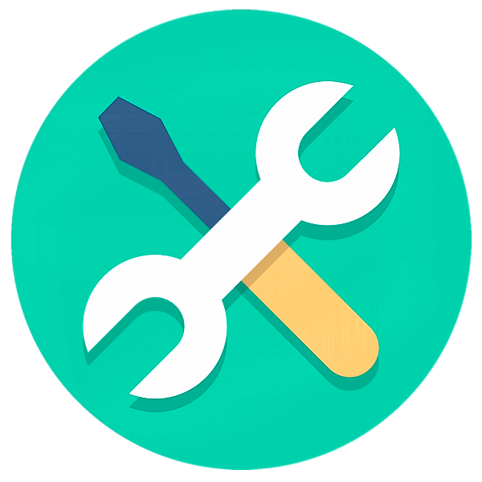 Технологический стек

<p align="center">


</p>

> В данном проекте автотесты написаны на <code>Java</code> с использованием фреймворков <code>Selenide</code> и <code>Appium</code> для UI-тестов и библиотеки <code>REST Assured</code> для отображения видео в отчете.
>
> <code>BrowserStack</code> выполняет запуск приложения на удаленном мобильном Android-устройстве.
>
> <code>Selenoid</code> выполняет запуск приложения на удаленном сервере.
>
> <code>Allure Report</code> формирует отчет о запуске тестов.
>
> Для автоматизированной сборки проекта используется <code>Gradle</code>.
>
> В качестве библиотеки для модульного тестирования используется <code>JUnit 5</code>.
>
> <code>Jenkins</code> выполняет запуск тестов.
>
> Автотесты интегрируются с тест-менеджмент системой <code>Allure TestOps</code>.

##  Запуск тестов из терминала

### :joystick: Запуск тестов

```
gradle clean ${TASK}
-DdeviceHost=${DEVICE_HOST}
```

> <details>
> <summary> :information_source: Для запуска тестов должны существовать следующие файлы ⇩ </summary>
>
> <details>
> <summary> :point_left: <code>browserstack.properties</code> </summary>
>
> **В файле должны быть расположены:**
> + <code>user_name</code> и <code>access_key</code> – данные, расположеные в настройках _BrowserStack_ для _App Automate_
> + <code>appURL</code> – ссылка на приложение, для которого будут запускаться тесты
> + <code>remoteURL</code> – адрес удаленного сервера, где будут запускаться тесты
> + <code>device</code> – имя девайса, на котором будут запускаться тесты
> + <code>os_version</code> – версия операционной системы девайса
> + <code>project</code> – название проекта
> + <code>build</code> – название сборки
> + <code>name</code> – название группы тестов
> </details>
>
> <details>
> <summary> :point_left: <code>selenoid.properties</code> </summary>
>
> **В файле должны быть расположены:**
> + <code>selenoidURL</code> – адрес удаленного сервера, на котором будут запускаться тесты
> + <code>login</code> и <code>password</code> – данные для авторизации на удаленном сервере
> + <code>deviceName</code> – имя девайса, на котором будут запускаться тесты
> + <code>platformName</code> – имя платформы, на которой будут запускаться тесты
> + <code>version</code> – версия операционной системы девайса
> + <code>locale</code> – локализация приложения (код по стандарту [ISO-639](https://ru.wiktionary.org/wiki/%D0%92%D0%B8%D0%BA%D0%B8%D1%81%D0%BB%D0%BE%D0%B2%D0%B0%D1%80%D1%8C:ISO_639))
> + <code>language</code> – язык приложения (код по стандарту [ISO-639](https://ru.wiktionary.org/wiki/%D0%92%D0%B8%D0%BA%D0%B8%D1%81%D0%BB%D0%BE%D0%B2%D0%B0%D1%80%D1%8C:ISO_639))
> + <code>appPackage</code> – идентификатор пакета приложения
> + <code>appActivity</code> – название основной активности приложения
> + <code>appURL</code> – ссылка на приложение, для которого будут запускаться тесты
> + <code>videoStorageURL</code> – адрес хранилища видео выполненных тестов
> </details>
>
> <details>
> <summary> :point_left: <code>emulation.properties</code> </summary>
>
> **В файле должны быть расположены:**
> + <code>deviceName</code> – имя девайса, на котором будут запускаться тесты
> + <code>platformName</code> – имя платформы, на которой будут запускаться тесты
> + <code>version</code> – версия операционной системы девайса
> + <code>locale</code> – локализация приложения (код по стандарту [ISO-639](https://ru.wiktionary.org/wiki/%D0%92%D0%B8%D0%BA%D0%B8%D1%81%D0%BB%D0%BE%D0%B2%D0%B0%D1%80%D1%8C:ISO_639))
> + <code>language</code> – язык приложения (код по стандарту [ISO-639](https://ru.wiktionary.org/wiki/%D0%92%D0%B8%D0%BA%D0%B8%D1%81%D0%BB%D0%BE%D0%B2%D0%B0%D1%80%D1%8C:ISO_639))
> + <code>appPackage</code> – идентификатор пакета приложения
> + <code>appActivity</code> – название основной активности приложения
> + <code>app</code> – путь до приложения, для которого будут запускаться тесты
> + <code>remoteURL</code> – адрес удаленного сервера, на котором будут запускаться тесты
> </details>
>
> <details>
> <summary> :point_left: <code>real.properties</code> </summary>
>
> **В файле должны быть расположены:**
> + <code>deviceName</code> – имя девайса, на котором будут запускаться тесты
> + <code>platformName</code> – имя платформы, на которой будут запускаться тесты
> + <code>version</code> – версия операционной системы девайса
> + <code>locale</code> – локализация приложения (код по стандарту [ISO-639](https://ru.wiktionary.org/wiki/%D0%92%D0%B8%D0%BA%D0%B8%D1%81%D0%BB%D0%BE%D0%B2%D0%B0%D1%80%D1%8C:ISO_639))
> + <code>language</code> – язык приложения (код по стандарту [ISO-639](https://ru.wiktionary.org/wiki/%D0%92%D0%B8%D0%BA%D0%B8%D1%81%D0%BB%D0%BE%D0%B2%D0%B0%D1%80%D1%8C:ISO_639))
> + <code>appPackage</code> – идентификатор пакета приложения
> + <code>appActivity</code> – название основной активности приложения
> + <code>app</code> – путь до приложения, для которого будут запускаться тесты
> + <code>remoteURL</code> – адрес удаленного сервера, на котором будут запускаться тесты
> </details>
>
> </details>

### :joystick: Параметры сборки

> <details>
> <summary> :point_left: <code>TASK</code> – список тестов, сгруппированных по параметру тега. В зависимости от выбранного параметра будут запускаться определенные группы тестов.</summary>
>
> **Доступные варианты:**
>
> + <code>browserstack</code> – запуск тестов с тегом _browserstack_ на платформе BrowserStack
> + <code>selenoid</code> – запуск тестов с тегом _selenoid_ на удаленном сервере Selenoid
> + <code>emulation</code> – запуск тестов с тегом _emulation_ на локальном эмуляторе устройства
> + <code>real</code> – запуск тестов с тегом _real_ на реальном устройстве при его подключении через USB
> </details>
>
> <details>
> <summary> :point_left: <code>DEVICE_HOST</code> – список параметров для запуска приложения. В зависимости от выбранного параметра приложение будет запускаться на соответствующих стендах.</summary>
>
> **Доступные варианты:**
>
> + <code>browserstack</code> – запуск приложения на удаленном мобильном Android-устройстве на платформе _BrowserStack_
> + <code>selenoid</code> – запуск приложения на удаленном сервере _Selenoid_
> + <code>emulation</code> – запуск приложения на локальном эмуляторе мобильного Android-устройства в _Android Studio IDE_
> + <code>real</code> – запуск приложения на _реальном устройстве_ при его подключении через USB
> </details>

### :joystick: Формирование отчета Allure

```
allure serve build/allure-results
```

> :exclamation: Для формирования отчета должен быть установлен <code>Allure</code>.

##  Запуск тестов в [Jenkins](https://jenkins.autotests.cloud/job/jjfhj-wikipedia_mobile_test/)

### :rocket: Для запуска тестов в Jenkins необходимо выполнить следующие шаги:

1. Открыть сборку [Jenkins](https://jenkins.autotests.cloud/job/jjfhj-wikipedia_mobile_test/)
2. Нажать на таск <code>"Собрать с параметрами"</code>
3. Указать [значения параметров](#joystick-параметры-сборки)
4. Нажать на кнопку <code>"Собрать"</code>

<p align="center">
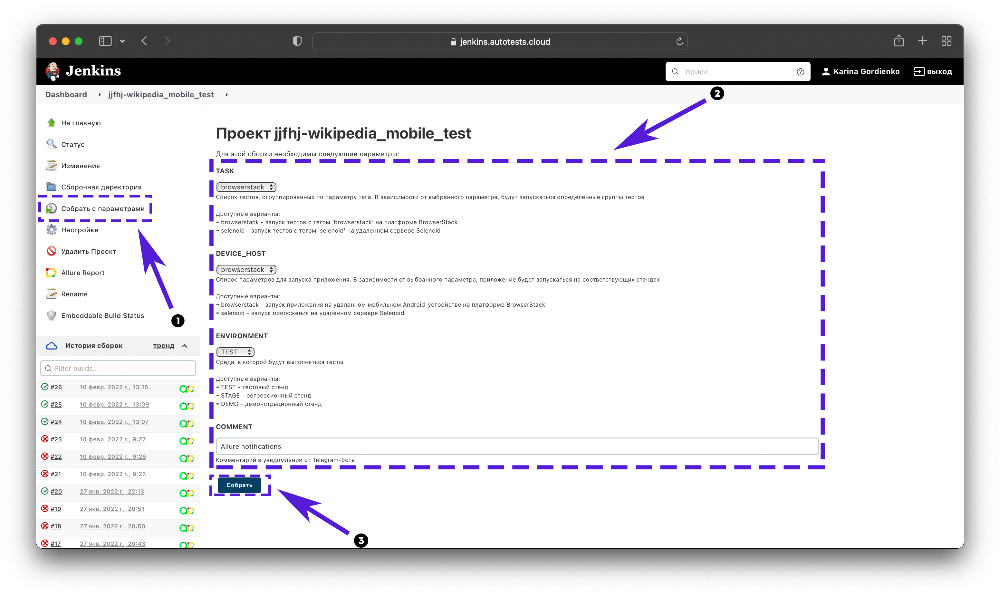
</p>

### :rocket: Для формирования отчета о прохождении тестов в Allure Report необходимо выполнить следующий шаг:

3. После выполнения сборки нажать на любую
   ссылку/иконку  <code>"Allure Report"</code>

<p align="center">
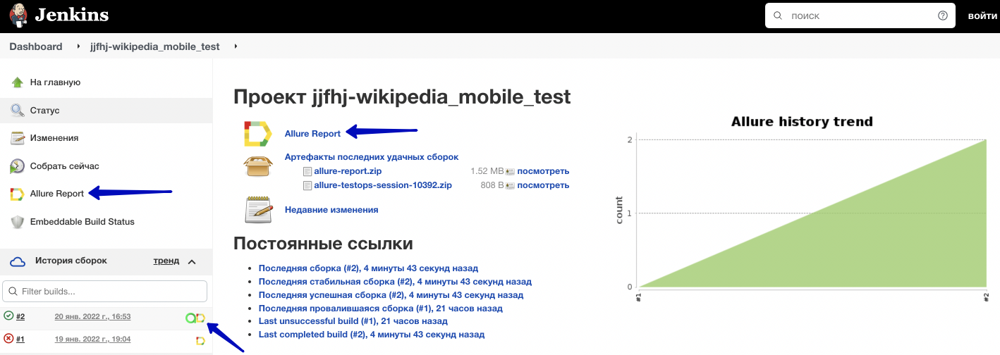
</p>

##  Отчет о результатах тестирования в [Allure Report](https://jenkins.autotests.cloud/job/jjfhj-wikipedia_mobile_test/allure/)

> [**Allure-framework**](https://habr.com/ru/company/sberbank/blog/358836/) используется в качестве инструмента для построения отчетов о прогоне автотестов.
> Он позволяет получить информацию о ходе выполнения тестов, а также прикрепить скриншоты, логи и видео к формируемому отчету.
> Имеется возможность указать различные теги, приоритеты и прочую сопутствующую информацию для тестов.
>
> <details>
> <summary> :point_left: Страница <code>Overview</code> </summary>
>
> Сраница <code>Overview</code> является главной страницей Allure-отчета.
>
> **Состоит из следующих блоков:**
>
> + Блок <code>ALLURE REPORT</code> – включает в себя дату и время прохождения теста, общее количество прогнанных кейсов, а также диаграмму с указанием процента и количества успешных, упавших и сломавшихся в процессе выполнения тестов.
>
> + Блок <code>TREND</code> – показывает тренд прохождения тестов от сборки к сборке.
>
> + Блок <code>SUITES</code> – показывает распределение результатов тестов по тестовым наборам.
>
> + Блок <code>ENVIRONMENT</code> – показывает тестовое окружение, на котором запускались тесты.
>
> + Блок <code>CATEGORIES</code> – показывает распределение неуспешно прошедших тестов по видам дефектов.
>
> + Блок <code>FEATURES BY STORIES</code> – показывает распределение тестов по функционалу, который они проверяют.
>
> + Блок <code>EXECUTORS</code> – показывает исполнителя текущей сборки. Если выполнение производилось на инструменте CI (например, на Jenkins), то будет предоставлена информация о джобе и номере сборки.
>
> </details>

### :dart: Главная страница Allure-отчета

<p align="center">

</p>

> <details>
> <summary> :point_left: Страница <code>Graphs</code> </summary>
>
> На странице <code>Graphs</code> можно получить информацию о тестовом прогоне в графическом виде: статус прогона, распределение тестов по критичности, длительности прохождения, перезапускам, категориям дефектов и так далее.
> </details>

### :dart: Информация о тестовом прогоне в графическом виде

<p align="center">
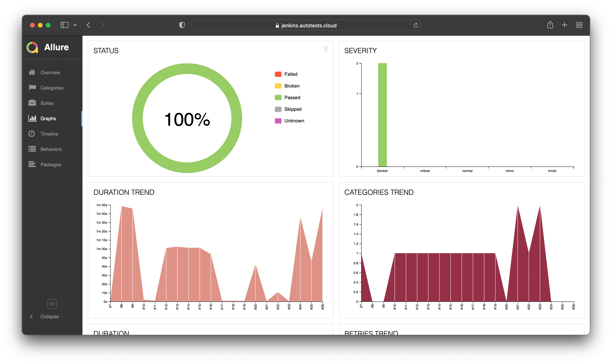
</p>

> <details>
> <summary> :point_left: Страница <code>Behaviors</code> </summary>
>
> На странице <code>Behaviors</code> тесты сгруппированы по проверяемому функционалу _(Epic, Feature, Story)_.
> </details>

### :dart: Группировка тестов по проверяемому функционалу

<p align="center">
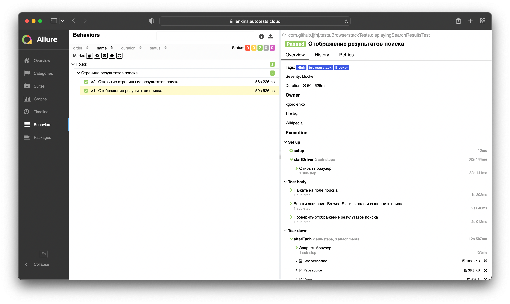
</p>

> <details>
> <summary> :point_left: <b>Прочие страницы</b> </summary>
>
> + Страница <code>Categories</code> – данная страница предоставляет информацио о распределении дефектов по их видам.
>
> + Страница <code>Suites</code> – на данной странице представляется стандартное распределение выполнявшихся тестов по тестовым наборам или классам, в которых находятся тестовые методы.
>
> + Страница <code>Timeline</code> – данная страница визуализирует временные рамки прохождения каждого теста.
>
> + Страница <code>Packages</code> – на этой странице тесты сгруппированы по пакетам, в которых лежат тестовые классы.
>
> </details>

##  Интеграция тестов c тест-менеджмент системой [Allure TestOps](https://allure.autotests.cloud/project/905/dashboards)

> <code>Allure TestOps</code> используется для хранения всех авто и ручных тестов, запусков и их результатов, а также статистики и отчетов.

### :jigsaw: Основной дашборд

<p align="center">
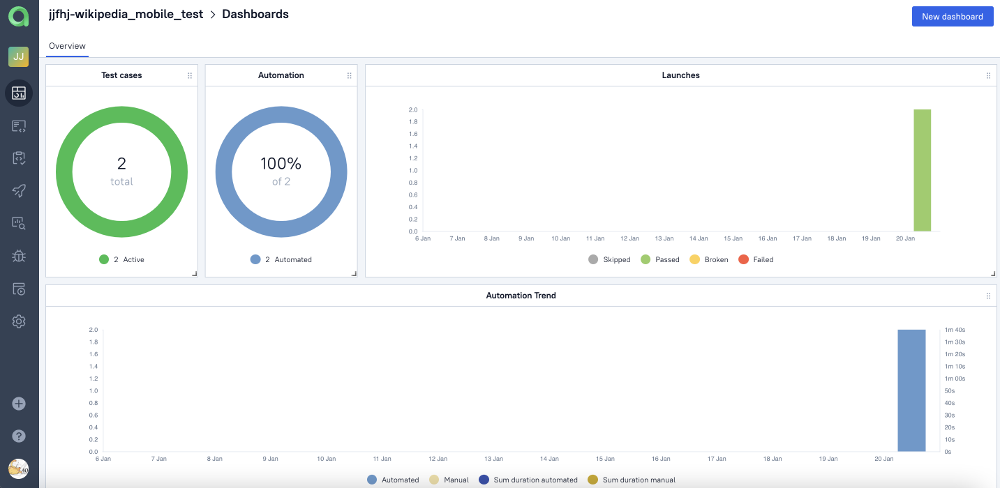
</p>

### :jigsaw: Запуски тестов

<p align="center">
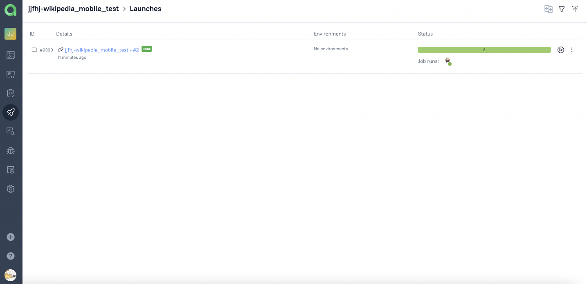
</p>

### :jigsaw: Результаты запуска тестов

<p align="center">
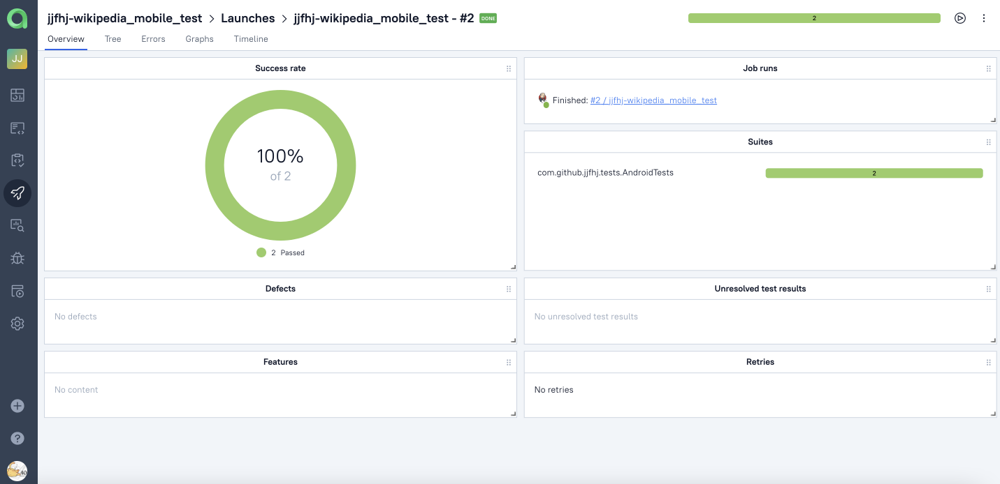
</p>

### :jigsaw: Сгруппированные тест-кейсы по проверяемому функционалу

<p align="center">
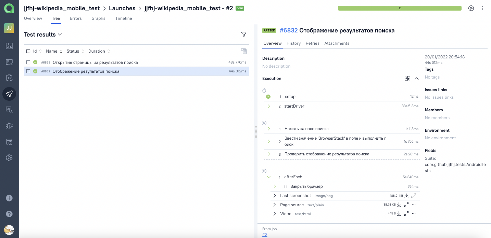
</p>

> К каждому тесту в отчете прилагается видео. Примеры таких видео представлены ниже.

##  Пример запуска теста в BrowserStack

<p align="center">
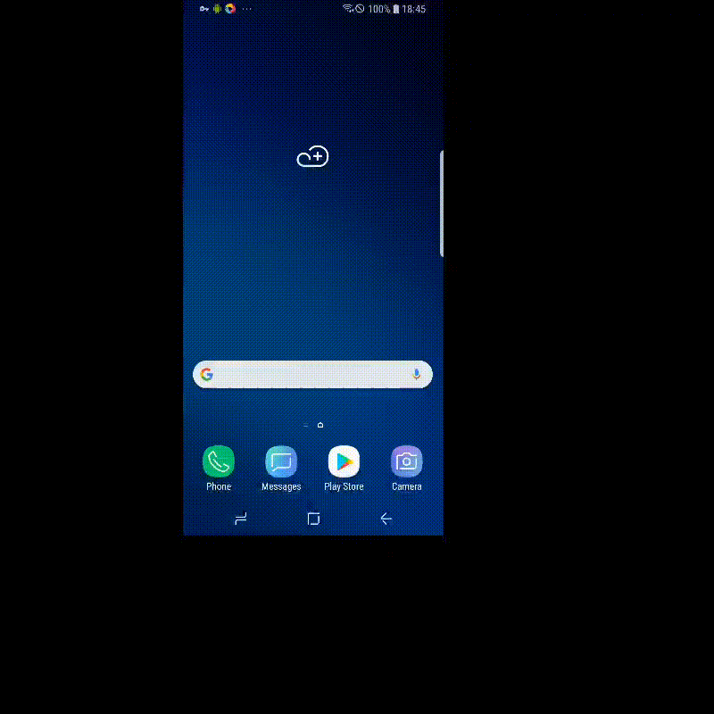
</p>

##  Пример запуска теста в Selenoid

<p align="center">
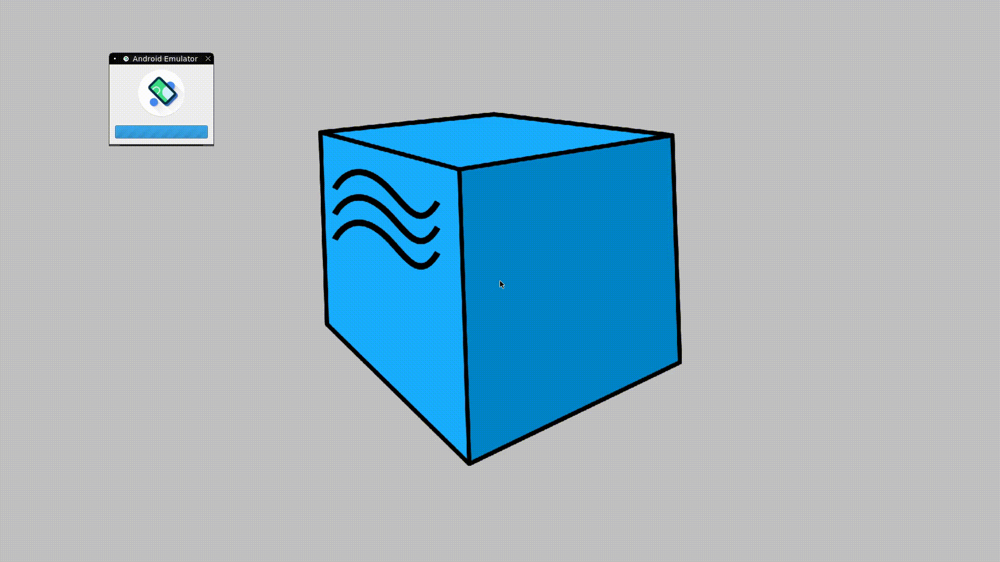
</p>
